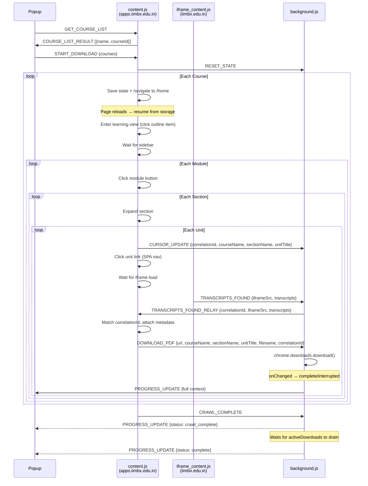

# IIMBx Transcript PDF Downloader — Complete Specification

## 1. Overview

A Chrome Extension (Manifest V3) that lets the user **select specific courses** from their IIMBx dashboard and automatically downloads every transcript PDF from those courses into a structured folder hierarchy.

**Platform:** `https://apps.iimbx.edu.in` (Open edX-based LMS)  
**Content host:** `https://iimbx.edu.in` (cross-origin iframe for xblocks)

---

## 2. Platform Architecture (from deep DOM exploration)

### 2.1 Two-Domain Architecture

| Domain | Role |
|:---|:---|
| `apps.iimbx.edu.in` | MFE (Micro Frontend) — dashboard, course home, learning shell, sidebar |
| `iimbx.edu.in` | LMS backend — xblocks rendered inside `<iframe#unit-iframe>`, hosts PDF assets |

> [!CAUTION]
> The transcript download links live inside a **cross-origin iframe** (`iimbx.edu.in` embedded inside `apps.iimbx.edu.in`). The content script must be injected with `all_frames: true` and `host_permissions` must cover **both** domains.

### 2.2 Navigation Hierarchy

```
Dashboard (apps.iimbx.edu.in/learner-dashboard/)
  └─ Course Card  ──click──►  Course Home (/learning/course/{COURSE_ID}/home)
                                  └─ Resume Course  ──redirect──►  Learning View (/learning/course/{COURSE_ID}/block-v1:...)
                                                                    ├─ Sidebar (modules → sections → units)
                                                                    └─ Content Area (iframe#unit-iframe)
                                                                          └─ Transcript PDF link (a.btn-link.external-track)
```

> [!IMPORTANT]
> The **sidebar only exists on the Learning View** (`/block-v1:...` URLs), NOT on the Course Home (`/home`). The extension must first enter the learning view by clicking "Resume course" or by clicking the first item in the course outline. The "Resume course" button triggers a redirect chain: `iimbx.edu.in/courses/.../jump_to/...` → `apps.iimbx.edu.in/learning/course/.../block-v1:...`.

### 2.3 URL Patterns

| Page | URL Pattern | Example |
|:---|:---|:---|
| Dashboard | `apps.iimbx.edu.in/learner-dashboard/` | — |
| Course Home | `apps.iimbx.edu.in/learning/course/course-v1:{ORG}+{CODE}+{RUN}/home` | `course-v1:IIIMBx+MD51x+BBA_DBE_B1` |
| Learning View | `apps.iimbx.edu.in/learning/course/course-v1:{ORG}+{CODE}+{RUN}/block-v1:...+type@sequential+block@{ID}/block-v1:...+type@vertical+block@{ID}` | — |
| xBlock iframe | `iimbx.edu.in/xblock/block-v1:{ORG}+{CODE}+{RUN}+type@vertical+block@{ID}?...` | — |
| Transcript PDF | `iimbx.edu.in/assets/courseware/v1/{HASH}/asset-v1:{ORG}+{CODE}+{RUN}+type@asset+block/{FILENAME}.pdf` | `BE_M00_C01_-_Introduction_to_Behavioural_Economics.pdf` |

---

## 3. DOM Selectors Reference (every selector the extension must use)

### 3.1 Dashboard — Course Cards

```
Container:       .course_page_main_title  (h1 "My Courses")
Course rows:     .col-sm-4.col-lg-3.fade-in (parent div of each card)
Course link:     a[href*="/learning/course/course-v1:"]
Course name:     a > div.courses-block > div.details > div > h2
Course image:    a > div.courses-block > div.img > img.course-image
Date range:      span.course-date
```

**Example course card outer HTML:**
```html
<a href="https://apps.iimbx.edu.in/learning/course/course-v1:IIIMBx+MD51x+BBA_DBE_B1/home">
  <div class="courses-block">
    <div class="img">
      
    </div>
    <div class="details">
      <div>
        <h2>Behavioural Economics</h2>
        <div class="course-info">
          <span class="course-date">18 Feb 2026 - 07 Jun 2026</span>
        </div>
      </div>
    </div>
  </div>
</a>
```

**Extracting course ID from href:**
```javascript
const courseId = href.match(/course-v1:[^/]+/)?.[0];
// e.g. "course-v1:IIIMBx+MD51x+BBA_DBE_B1"
```

**Total courses observed:** 32

### 3.2 Course Home Page

```
Course title:    h1  (or extract from document.title which is "Course | {Name} | IIMBx")
Tabs:            a.nav-item.nav-link  ("Course", "Progress", "Dates", "Discussion", "Syllabus")
Resume button:   a.btn.btn-brand.btn-block[href*="jump_to"]
Handouts:        (find by text content match: querySelectorAll('h2') then filter by textContent === "Course Handouts")
Outline items:   a[href*="block-v1:"] within the course outline section
```

> [!NOTE]
> `:contains()` is NOT a valid CSS selector for `querySelector`. For text-based element matching, use `querySelectorAll('h2')` and then filter via `.textContent` in JavaScript.

**Resume button href pattern:**
```
https://iimbx.edu.in/courses/course-v1:{ID}/jump_to/block-v1:{ID}+type@html+block@{HASH}
```

> [!WARNING]
> The extension must NOT navigate to `/home` and expect a sidebar. It must enter the **Learning View** first. Two strategies:
> 1. **Click Resume course** — triggers redirect, land on a `/block-v1:` URL with sidebar.
> 2. **Click the first outline item** on the course home page — navigates directly to a learning view URL.
>
> **Chosen:** Navigate to `/home`, find and click the first available `a[href*="block-v1:"]` link in the outline, which navigates to a learning view with the sidebar. If not found, click the Resume course button as fallback.

### 3.3 Learning View — Sidebar

The sidebar has a **two-level navigation**: first you see the module list, then clicking a module shows its sections/units.

#### Module List (top level of sidebar)

```
Sidebar container:  section.outline-sidebar.w-100
Module list:        ol#outline-sidebar-outline.list-unstyled > li
Module button:      button.btn-tertiary (contains module name as text)
Module heading:     button.outline-sidebar-heading (shows current module name + back arrow)
```

**Example module button HTML:**
```html
<button class="btn-tertiary" type="button">
  <div>Module 0: Welcome to the Course</div>
  <span class="text-gray-500 x-small">4 ungraded activities</span>
</button>
```

**Module name extraction:**
```javascript
const moduleName = button.querySelector('div')?.textContent?.trim();
// "Module 0: Welcome to the Course"
```

#### Inside a Module — Section Headers

```
Section header:   div.collapsible-trigger
Section title:    div.collapsible-trigger > span.align-self-start (text like "0.1 Course Overview")
Collapse body:    div.collapsible-body (contains unit list, toggled by clicking trigger)
Section state:    Add "is-open" class on parent .pgn_collapsible when expanded
```

**Example section trigger HTML:**
```html
<div class="collapsible-trigger" role="button" tabindex="0" aria-expanded="true">
  <span class="mr-1 text-dark-500 align-self-start">0.1 Course Overview</span>
  <span class="text-gray-500">Incomplete</span>
  <svg><!-- chevron icon --></svg>
</div>
```

**Section name extraction:**
```javascript
const sectionName = trigger.querySelector('span.align-self-start, span.mr-1')?.textContent?.trim();
// "0.1 Course Overview"
```

#### Inside a Section — Unit Links

```
Unit list:        div.collapsible-body > ol.list-unstyled > li
Unit link:        a.row.w-100.m-0.d-flex.align-items-center.text-gray-700
                  — OR simpler: a[href*="type@vertical+block@"]
Unit title:       a > span.list-item-title
Unit icon:        a > svg (video icon, text icon, problem icon, etc.)
Active unit:      a has class "font-weight-bold active" when selected
```

**Example unit link HTML:**
```html
<a class="row w-100 m-0 d-flex align-items-center text-gray-700"
   href="/learning/course/course-v1:IIIMBx+MD51x+BBA_DBE_B1/block-v1:IIIMBx+MD51x+BBA_DBE_B1+type@sequential+block@af8411a35cee4b8085b2a01c16034eac/block-v1:IIIMBx+MD51x+BBA_DBE_B1+type@vertical+block@444b76d02ce44fb89d2bb3cb128ddcfe">
  <svg><!-- video icon --></svg>
  <span class="list-item-title ml-2 p-0 flex-grow-1 text-left text-truncate">
    0.1.2 Introduction to the Course
  </span>
</a>
```

**Unit title extraction:**
```javascript
const unitTitle = link.querySelector('.list-item-title')?.textContent?.trim();
// "0.1.2 Introduction to the Course"
```

**Unit URL pattern:**
```
/learning/course/course-v1:{ID}/block-v1:{ID}+type@sequential+block@{SEQ_HASH}/block-v1:{ID}+type@vertical+block@{VERT_HASH}
```

### 3.4 Content Area — Iframe

```
Iframe element:   iframe#unit-iframe
Iframe src:       https://iimbx.edu.in/xblock/block-v1:{ID}+type@vertical+block@{HASH}?show_title=0&show_bookmark_button=0&...
```

**Iframe attributes observed:**
```html
<iframe id="unit-iframe"
  title="0.1.2 Introduction to the Course"
  src="https://iimbx.edu.in/xblock/block-v1:IIIMBx+MD51x+BBA_DBE_B1+type@vertical+block@444b76d02ce44fb89d2bb3cb128ddcfe?show_title=0&show_bookmark_button=0&recheck_access=1&view=student_view"
  allow="microphone *; camera *; clipboard-write *"
  allowfullscreen="">
</iframe>
```

### 3.5 Inside Iframe — Transcript PDF Links

```
Transcript heading:  h3 (text "Transcripts")
Download link:       a.btn-link.external-track[href$=".pdf"]
                     — Text content: "Download transcript"
Video block:         div.xblock.xblock-student_view (multiple on one page)
```

**Example transcript link HTML:**
```html
<h3>Transcripts</h3>
<a class="btn-link external-track"
   href="https://iimbx.edu.in/assets/courseware/v1/bede9b6f6f0398156e9464bf9e045c7b/asset-v1:IIIMBx+MD51x+BBA_DBE_B1+type@asset+block/BE_M00_C01_-_Introduction_to_Behavioural_Economics.pdf"
   data-source-url="/assets/courseware/...">
  Download transcript
</a>
```

> [!IMPORTANT]
> A single unit page (inside the iframe) can contain **multiple videos**, each with its own transcript link. The content script must find ALL `a.btn-link.external-track[href$=".pdf"]` links on the page.

**PDF URL pattern:**
```
https://iimbx.edu.in/assets/courseware/v1/{HASH}/asset-v1:{COURSE_ID}+type@asset+block/{FILENAME}.pdf
```

---

## 4. Feature: Course Selection

### 4.1 Requirements

- The popup UI must display a **list of all enrolled courses** with checkboxes
- User can select/deselect individual courses
- A "Select All" / "Deselect All" toggle
- The "Download Transcripts" button only processes selected courses
- Selected courses are remembered in `chrome.storage.local` for next session

### 4.2 How to populate the course list

When the popup opens, it must get the list of courses.

**Approach — Content script scrapes dashboard:**
1. Popup sends a message to the content script on the active tab
2. Content script reads `document.querySelectorAll('a[href*="/learning/course/course-v1:"]')` on the dashboard
3. Returns `{ name, courseId, imgSrc }` array to popup
4. Popup renders checkboxes

> [!NOTE]
> If the user is NOT on the dashboard page, the popup should show a message: "Please navigate to your IIMBx dashboard first" with a link/button to go there.

### 4.3 UI Flow

```
1. User clicks extension icon
2. Popup opens, checks if current tab is on apps.iimbx.edu.in
   ├── On dashboard: fetches course list from content script, renders checkboxes
   └── NOT on dashboard: shows "Navigate to dashboard" message
3. User selects courses, clicks "Download Transcripts"
4. Popup sends selected courses (with names) to content script
5. Content script begins sequential processing:
   a. Navigate to first selected course's home page
   b. Enter learning view (click first outline item or Resume)
   c. Iterate modules → sections → units
   d. For each unit: click it, wait for iframe, extract PDF URLs
   e. Content script sends downloadPDF (with all metadata) to background
   f. Move to next course
6. Progress updates appear in popup real-time
7. Completion summary shown when done
```

---

## 5. File Structure

```
Transcirpt_Downloader/
├── manifest.json        # Manifest V3 config
├── popup.html           # Extension popup UI
├── popup.css            # Popup styling
├── popup.js             # Popup logic (course list, start button, progress)
├── content.js           # Main content script (dashboard + learning pages)
├── iframe_content.js    # Content script for iframe domain (transcript extraction)
├── background.js        # Service worker (download management)
└── icons/
    ├── icon16.png       # 16x16 extension icon
    ├── icon48.png       # 48x48 extension icon
    └── icon128.png      # 128x128 extension icon
```

---

## 6. Manifest V3 — `manifest.json`

```json
{
  "manifest_version": 3,
  "name": "IIMBx Transcript Downloader",
  "version": "1.0.0",
  "description": "Download all transcript PDFs from IIMBx courses",
  "permissions": [
    "downloads",
    "storage",
    "unlimitedStorage",
    "activeTab",
    "scripting"
  ],
  "host_permissions": [
    "https://apps.iimbx.edu.in/*",
    "https://iimbx.edu.in/*"
  ],
  "action": {
    "default_popup": "popup.html",
    "default_icon": {
      "16": "icons/icon16.png",
      "48": "icons/icon48.png",
      "128": "icons/icon128.png"
    }
  },
  "background": {
    "service_worker": "background.js"
  },
  "content_scripts": [
    {
      "matches": ["https://apps.iimbx.edu.in/*"],
      "js": ["content.js"],
      "run_at": "document_idle"
    },
    {
      "matches": ["https://iimbx.edu.in/*"],
      "js": ["iframe_content.js"],
      "all_frames": true,
      "run_at": "document_idle"
    }
  ],
  "icons": {
    "16": "icons/icon16.png",
    "48": "icons/icon48.png",
    "128": "icons/icon128.png"
  }
}
```

> [!IMPORTANT]
> Two separate content scripts:
> - `content.js` runs on the main MFE domain (`apps.iimbx.edu.in`) — handles navigation and sidebar interaction
> - `iframe_content.js` runs on the LMS domain (`iimbx.edu.in`) inside iframes — detects and reports transcript PDF links

---

## 7. Canonical Message Protocol

All message types, schemas, producers, and consumers in one place. Every script must use these exact type names.

| Message Type | Producer | Consumer | Payload Schema |
|:---|:---|:---|:---|
| `GET_COURSE_LIST` | popup.js | content.js | `{}` |
| `COURSE_LIST_RESULT` | content.js | popup.js | `{ courses: [{ name, courseId, imgSrc }] }` |
| `START_DOWNLOAD` | popup.js | content.js | `{ courses: [{ courseId, name }] }` |
| `TRANSCRIPTS_FOUND` | iframe_content.js | background.js | `{ iframeSrc, transcripts: [{ url, filename, videoTitle }] }` |
| `TRANSCRIPTS_FOUND_RELAY` | background.js | content.js | `{ iframeSrc, correlationId, transcripts: [{ url, filename, videoTitle }] }` |
| `DOWNLOAD_PDF` | content.js | background.js | `{ url, courseName, sectionName, unitTitle, filename, correlationId }` |
| `PROGRESS_UPDATE` | background.js | popup.js | `ProgressSnapshot` (see schema below) |
| `CRAWL_COMPLETE` | content.js | background.js | `{}` — signals crawling is done; background waits for all downloads to finish |
| `GET_PROGRESS` | popup.js | background.js | `{}` → response: `ProgressSnapshot` |
| `RESET_STATE` | content.js | background.js | `{}` |
| `CURSOR_UPDATE` | content.js | background.js | `{ correlationId, expectedBlockId, courseName, sectionName, unitTitle }` |

### ProgressSnapshot Schema

Used by both `PROGRESS_UPDATE` broadcasts and `GET_PROGRESS` responses. This is the **single source of truth** for popup UI state:

```javascript
// ProgressSnapshot
{
  type: 'PROGRESS_UPDATE',         // or omitted in GET_PROGRESS response
  status: 'idle' | 'downloading' | 'crawl_complete' | 'complete' | 'error',
  isRunning: true | false,
  courseName: 'Behavioural Economics',
  sectionName: '0.1 Course Overview',
  unitTitle: '0.1.2 Introduction to the Course',
  downloaded: 23,                  // completed file writes
  total: 48,                       // queued downloads
  errors: 1,
  activeDownloads: 3,              // currently in-flight
  percent: 48                      // Math.round(downloaded / total * 100)
}
```

### Message Flow — Who Owns What

- **`iframe_content.js`** owns: detecting transcript PDF links. It sends `TRANSCRIPTS_FOUND` with `iframeSrc` (for correlation) and raw transcript data. It does NOT know course/section/unit names.
- **`content.js`** owns: navigation context (courseName, sectionName, unitTitle). It listens for `TRANSCRIPTS_FOUND_RELAY` from background, matches by `correlationId`, attaches metadata, and sends `DOWNLOAD_PDF` to background.
- **`background.js`** owns: downloading files, tracking download lifecycle, relaying iframe messages with correlation, broadcasting progress, persisting durable state.
- **`popup.js`** owns: rendering UI, sending start commands, displaying progress via `ProgressSnapshot`.

### Correlation ID Strategy

To avoid late/stale iframe messages being attributed to the wrong unit:

```javascript
// content.js generates correlationId before clicking a unit
const correlationId = `${courseId}::${unitHref}::${Date.now()}`;

// Store as "expected" correlation
currentCorrelationId = correlationId;

// Extract the expected iframe block ID from the unit href
// e.g. unitHref contains "type@vertical+block@444b76d0..." → extract block ID
const expectedBlockId = unitHref.match(/type@vertical\+block@([a-f0-9]+)/)?.[1] || '';

// Send to background — binds this correlationId to the expected iframe block ID
chrome.runtime.sendMessage({
  type: 'CURSOR_UPDATE',
  correlationId,
  expectedBlockId,   // background uses this to match incoming TRANSCRIPTS_FOUND
  courseName, sectionName, unitTitle
});

// content.js checks: if relay.correlationId !== currentCorrelationId → ignore (stale)
```

**Background binds correlation at click time, not relay time:**
```javascript
// On CURSOR_UPDATE: store the binding
state.cursor = {
  correlationId: message.correlationId,
  expectedBlockId: message.expectedBlockId,
  courseName: message.courseName,
  sectionName: message.sectionName,
  unitTitle: message.unitTitle
};

// On TRANSCRIPTS_FOUND from iframe:
// 1. Check if message.iframeSrc contains state.cursor.expectedBlockId
// 2. If YES → relay with the BOUND correlationId (set at click time)
// 3. If NO → drop as stale (came from a previous unit's iframe)
// This prevents a late iframe message from being tagged with the current cursor's correlation
```

---

## 8. Detailed File Specifications

### 8.1 `popup.html` + `popup.css`

**Layout:**
```
┌────────────────────────────────────────┐
│  📄 IIMBx Transcript Downloader       │
│────────────────────────────────────────│
│  ☐ Select All                         │
│────────────────────────────────────────│
│  ☑ Behavioural Economics              │
│  ☑ New-Age Business Models            │
│  ☐ Principles of Macroeconomics       │
│  ☑ Digital Marketing Strategy         │
│  ... (scrollable list)                │
│────────────────────────────────────────│
│  [ 🔽 Download Transcripts ]          │
│────────────────────────────────────────│
│  Status: Downloading...               │
│  ████████░░░░ 65%                     │
│  Course: Behavioural Economics (2/4)  │
│  Section: 1.2 Decision Making         │
│  Unit: 1.2.3 Anchoring Effect         │
│  Downloaded: 23 / 48 PDFs             │
│────────────────────────────────────────│
│  ✅ 12 transcripts from Course 1      │
│  ✅ 11 transcripts from Course 2      │
│  ⏳ Processing Course 3...            │
└────────────────────────────────────────┘
```

**Dimensions:** `width: 420px; min-height: 500px; max-height: 600px`  
**Theme:** Dark (#1a1a2e background, #16213e cards, #0f3460 accents, #e94560 primary button)

**popup.html structure:**
```html
<!DOCTYPE html>
<html>
<head>
  <link rel="stylesheet" href="popup.css">
</head>
<body>
  <div class="container">
    <header>
      <h1>📄 IIMBx Transcript Downloader</h1>
    </header>

    <!-- State 1: Not on dashboard -->
    <div id="not-on-dashboard" class="hidden">
      <p>Please navigate to your IIMBx dashboard</p>
      <button id="go-to-dashboard">Go to Dashboard</button>
    </div>

    <!-- State 2: Course list + selection -->
    <div id="course-selection" class="hidden">
      <div class="select-all-row">
        <label><input type="checkbox" id="select-all"> Select All</label>
      </div>
      <div id="course-list" class="course-list">
        <!-- Dynamically populated -->
      </div>
      <button id="start-download" class="primary-btn">🔽 Download Transcripts</button>
    </div>

    <!-- State 3: Progress -->
    <div id="progress-section" class="hidden">
      <div id="status-text">Initializing...</div>
      <div class="progress-bar"><div id="progress-fill"></div></div>
      <div id="current-course"></div>
      <div id="current-section"></div>
      <div id="current-unit"></div>
      <div id="download-count"></div>
      <div id="log" class="log-area"></div>
    </div>
  </div>
  <script src="popup.js"></script>
</body>
</html>
```

### 8.2 `popup.js`

**Responsibilities:**
1. On open: detect if current tab URL matches `apps.iimbx.edu.in/learner-dashboard`
2. If yes: send `GET_COURSE_LIST` message to content script → render checkboxes
3. If no: show "Navigate to dashboard" state
4. On "Download Transcripts" click: send `START_DOWNLOAD` with selected courses (including names) to content script
5. Listen for `PROGRESS_UPDATE` messages from background → update UI
6. On "Go to Dashboard" click: `chrome.tabs.update(tabId, { url: '...' })`
7. On popup open mid-processing: call `GET_PROGRESS` to background → restore UI state

**State management:**
```javascript
// Save selected courses for next session
chrome.storage.local.set({ selectedCourses: [...courseIds] });

// Restore on popup open
chrome.storage.local.get('selectedCourses', (data) => { ... });
```

### 8.3 `content.js` (runs on `apps.iimbx.edu.in`)

This is the **main orchestrator** — the most complex file.

**Message listener setup:**
```javascript
chrome.runtime.onMessage.addListener((message, sender, sendResponse) => {
  if (message.type === 'GET_COURSE_LIST') {
    handleGetCourseList(sendResponse);
    return true; // async response
  }
  if (message.type === 'START_DOWNLOAD') {
    handleStartDownload(message.courses);
    sendResponse({ status: 'started' });
  }
  if (message.type === 'TRANSCRIPTS_FOUND_RELAY') {
    // Relayed from background — contains correlationId
    handleTranscriptsFoundRelay(message);
  }
});
```

#### Function: `handleGetCourseList(sendResponse)`

```
1. Check if current URL is the dashboard
2. Query: document.querySelectorAll('a[href*="/learning/course/course-v1:"]')
3. For each link:
   - name = link.querySelector('h2')?.textContent?.trim()
   - courseId = link.href.match(/course-v1:[^/]+/)?.[0]
   - imgSrc = link.querySelector('img.course-image')?.src
4. Deduplicate by courseId
5. sendResponse({ courses: courseList })
```

#### Function: `handleStartDownload(courses)`

**This is the core automation loop.** Sequential, not parallel, to avoid overwhelming the server.

```
for each course in selectedCourses:
  1. SAVE STATE to chrome.storage.local (before any navigation)

  2. Navigate to course home page:
     - Construct URL: `https://apps.iimbx.edu.in/learning/course/${courseId}/home`
     - window.location.href = url
     - (page reloads — content script destroyed — resume from storage on new load)

  --- AFTER PAGE RELOAD (resume from state) ---

  3. ENTER THE LEARNING VIEW:
     - Wait for course home page to load
     - Find first outline link: document.querySelector('a[href*="block-v1:"]')
     - If found: click it → SPA navigates to learning view (no page reload)
     - If not found (FALLBACK): click Resume button (a.btn.btn-brand[href*="jump_to"])
       → triggers redirect chain through iimbx.edu.in → lands on learning view
       → THIS CAN CAUSE A PAGE RELOAD — treat as reload-capable path:
         * SAVE full state (including "ENTERING_LEARNING_VIEW" + courseIndex) BEFORE clicking Resume
         * On reload, init() detects ENTERING_LEARNING_VIEW state and waits for sidebar
     - Wait for URL to contain "block-v1:"

  4. Wait for sidebar to appear:
     - Poll for: document.querySelector('section.outline-sidebar')
     - Timeout: 10 seconds

  5. Navigate to module list view:
     - Check if we're in "inside module" view (button.outline-sidebar-heading visible)
     - If yes: click the heading button to go back to module list
     - Wait for module buttons: document.querySelectorAll('button.btn-tertiary')

  6. For each module:
     a. Track currentModuleIndex in memory (loop counter — NOT persisted)
     b. Click the module button to enter it
     c. Wait for sections to appear: poll for .collapsible-trigger
     d. Get section headers: document.querySelectorAll('.collapsible-trigger')

     e. For each section:
        i.   Track currentSectionIndex in memory (loop counter — NOT persisted)
        ii.  Click section trigger to expand if not already open
             - Check: parent .pgn_collapsible has class "is-open"
             - If not open: click the trigger, wait 500ms for expansion animation
        iii. Get section name: trigger.querySelector('span.align-self-start')?.textContent
        iv.  Get unit links: section's .collapsible-body ol a[href*="type@vertical"]

        v. For each unit link:
           - Track currentUnitIndex in memory (loop counter — NOT persisted)
           - Get unit title: link.querySelector('.list-item-title')?.textContent
           - Generate correlationId: `${courseId}::${link.href}::${Date.now()}`
           - Extract expectedBlockId from unit href (regex: /type@vertical\+block@([a-f0-9]+)/)
           - Send CURSOR_UPDATE to background with {correlationId, expectedBlockId, courseName, sectionName, unitTitle}
           - Click the unit link (SPA navigation — content script stays alive)
           - Wait for iframe to load:
             * Poll for: document.querySelector('#unit-iframe')
             * Then wait for iframe src to contain expected block ID
             * Additional delay: 2000ms for content inside iframe to render
           - Wait for TRANSCRIPTS_FOUND_RELAY with matching correlationId
             * Timeout: 5 seconds (some units have no video)
           - On match: send DOWNLOAD_PDF to background for each transcript
             with {url, courseName, sectionName, unitTitle OR pdfBasename, filename, correlationId}
           - delay(1500) — rate limiting between unit clicks

     f. After all sections in module, click back button (button.outline-sidebar-heading)
     g. Wait for module list to re-render

  7. After all modules in course, move to next course
     - SAVE state with next course index
     - Navigate to next course home page (full page reload)

  8. When all courses done:
     - Send CRAWL_COMPLETE to background (crawling done; downloads may still be in-flight)
     - Clear processing state from chrome.storage.local
```

> [!WARNING]
> **Unit clicks are SPA navigations** — the content script is NOT destroyed. But **course switches require `window.location.href` changes** which DO destroy the content script. State must be saved to `chrome.storage.local` before every course navigation.
>
> **Resume button fallback** can also trigger a redirect chain (through `iimbx.edu.in`) that reloads the page. Treat Resume clicks as reload-capable and persist state before clicking.

**Helper function: `waitForElement(selector, timeout = 10000)`**
```javascript
function waitForElement(selector, timeout = 10000) {
  return new Promise((resolve, reject) => {
    const el = document.querySelector(selector);
    if (el) return resolve(el);

    const observer = new MutationObserver(() => {
      const el = document.querySelector(selector);
      if (el) {
        observer.disconnect();
        resolve(el);
      }
    });
    observer.observe(document.body, { childList: true, subtree: true });

    setTimeout(() => {
      observer.disconnect();
      reject(new Error(`Timeout waiting for ${selector}`));
    }, timeout);
  });
}
```

**Helper function: `delay(ms)`**
```javascript
const delay = (ms) => new Promise(r => setTimeout(r, ms));
```

#### Navigation & State Persistence

When navigating between courses (`window.location.href = ...`), the entire content script is destroyed. The extension handles this by:

1. Storing the current processing state in `chrome.storage.local` **before** every course navigation:
   ```javascript
   {
     processingState: {
       state: "NAVIGATING_TO_COURSE",  // or "ENTERING_LEARNING_VIEW"
       selectedCourses: [{ courseId, name }, ...],
       currentCourseIndex: 2
       // Module/section/unit indices are NOT persisted — they are in-memory only
       // (content script stays alive during SPA navigation within a course)
     }
   }
   ```
   > Note: dedup state (`queuedUrls`, `completedUrls`) lives in `downloadState` (background), not `processingState` (content).

2. On content script load (`init()`): check `chrome.storage.local` for pending state
3. If found and state is a reload-capable state (`NAVIGATING_TO_COURSE` or `ENTERING_LEARNING_VIEW`): resume processing from the stored position
4. Clear state when all courses are done

> [!IMPORTANT]
> State is saved **only before course-level navigations** (which cause page reloads). Within a single course, module/section/unit traversal happens via SPA clicks and the content script context remains alive.

### 8.4 `iframe_content.js` (runs on `iimbx.edu.in`, all frames)

**Responsibilities:**
1. Detect if the page contains transcript PDF links
2. Auto-report them to the background script with `iframeSrc` for correlation

```javascript
// Only act inside iframes (not top-level navigation to iimbx.edu.in)
if (window.self === window.top) return;

let lastReportedUrls = new Set();

function findAndReportTranscripts() {
  const links = document.querySelectorAll('a.btn-link.external-track[href$=".pdf"]');
  if (links.length === 0) return;

  // Dedup: only report if we haven't already reported this exact set
  const urls = Array.from(links).map(l => l.href).sort().join('|');
  if (lastReportedUrls.has(urls)) return;
  lastReportedUrls.add(urls);

  const transcripts = Array.from(links).map(link => ({
    url: link.href,
    filename: decodeURIComponent(link.href.split('/').pop()),
    // Extract video title from the nearest xblock heading
    videoTitle: link.closest('.xblock')?.querySelector('h3, h2')?.textContent?.trim()
      || link.closest('.xblock')?.querySelector('.video-title')?.textContent?.trim()
      || ''
  }));

  chrome.runtime.sendMessage({
    type: 'TRANSCRIPTS_FOUND',
    iframeSrc: window.location.href,
    transcripts: transcripts
  });
}

// Run immediately
findAndReportTranscripts();

// Also observe for dynamic content loading
const observer = new MutationObserver(() => {
  findAndReportTranscripts();
});
observer.observe(document.body, { childList: true, subtree: true });

// Cleanup after 30 seconds
setTimeout(() => observer.disconnect(), 30000);
```

**Edge case — multiple videos on one page:**  
A single xblock page (unit) can contain 2+ videos, each with its own transcript link. The `querySelectorAll` captures ALL of them.

**Edge case — no transcripts:**  
Some units are text-only, HTML, or problems with no video. `links.length === 0` → no message sent. The main content script handles the timeout.

### 8.5 `background.js`

**Responsibilities:**
1. Listen for `TRANSCRIPTS_FOUND` from iframe_content.js and relay to content.js
2. Listen for `DOWNLOAD_PDF` from content.js and download files
3. Track download **lifecycle** via `chrome.downloads.onChanged`
4. Send `PROGRESS_UPDATE` to popup with full context
5. Sanitize filenames
6. **Persist all durable state** to `chrome.storage.local` (survives service worker suspension)

#### Durable State (persisted to chrome.storage.local)

```javascript
// Persisted state schema — survives service worker restart
{
  downloadState: {
    queuedUrls: [...],          // URLs queued for download (for dedup at queue time)
    completedUrls: [...],       // URLs confirmed written to disk (for cross-run dedup)
    stats: { total: 0, completed: 0, errors: 0 },
    cursor: {                   // Current navigation context (for progress display)
      correlationId: "",
      expectedBlockId: "",      // iframe block ID expected for this unit (for stale-message gating)
      courseName: "",
      sectionName: "",
      unitTitle: ""
    },
    activeDownloads: {},        // Map of downloadId → { url, savePath, retryCount }
    pendingRetryCount: 0,       // Number of retries waiting in setTimeout (not yet requeued)
    isCrawling: false,          // Content script is still navigating
    isRunning: false            // Any downloads or crawling in progress
  }
}
```

> [!IMPORTANT]
> **`queuedUrls` vs `completedUrls`**: URLs are added to `queuedUrls` when a download is queued (prevents duplicate queueing). URLs are moved to `completedUrls` only when `onChanged` reports `state.current === "complete"`. This separation allows retries: when a download is `interrupted`, the URL is removed from `queuedUrls` (allowing re-queue) and NOT added to `completedUrls`.

**On service worker startup — with initialization guard:**
```javascript
let state = null;
let stateReady = null; // Promise that resolves when state is loaded

const DEFAULT_STATE = {
  queuedUrls: [],
  completedUrls: [],
  stats: { total: 0, completed: 0, errors: 0 },
  cursor: {},
  activeDownloads: {},
  isCrawling: false,
  isRunning: false
};

async function loadState() {
  const data = await chrome.storage.local.get('downloadState');
  state = data.downloadState || { ...DEFAULT_STATE };
}

// Guard: ensures state is loaded before any handler uses it
async function ensureStateLoaded() {
  if (state === null) {
    await stateReady;
  }
}

// Mutation queue: serializes all state writes to prevent interleaving
let writeQueue = Promise.resolve();

function saveState() {
  writeQueue = writeQueue.then(async () => {
    await chrome.storage.local.set({ downloadState: state });
  });
  return writeQueue;
}

// Load on startup, store the promise for ensureStateLoaded
stateReady = loadState();
```

> [!CAUTION]
> **State initialization race (#5):** `loadState()` is async. Handlers that fire during cold start (before load completes) must call `await ensureStateLoaded()` first. Every handler below begins with this guard.
>
> **Concurrent mutation (#6):** Rapid `DOWNLOAD_PDF` messages can interleave reads and writes. `saveState()` serializes through a `writeQueue` promise chain. State is kept **in-memory after first load** — `loadState()` is called once, not per-handler.

**Message handler (every branch guards with `ensureStateLoaded`):**
```javascript
chrome.runtime.onMessage.addListener((message, sender, sendResponse) => {
  // Wrap in async IIFE to use await; return true for async sendResponse
  (async () => {
    await ensureStateLoaded();

    if (message.type === 'TRANSCRIPTS_FOUND') {
      // Only relay if iframeSrc matches the expected block ID bound at click time
      const iframeSrc = message.iframeSrc || '';
      const expectedBlockId = state.cursor.expectedBlockId || '';
      if (expectedBlockId && !iframeSrc.includes(expectedBlockId)) {
        // Stale iframe message — drop it
        console.log(`Dropping stale TRANSCRIPTS_FOUND: expected block ${expectedBlockId}, got ${iframeSrc}`);
        return;
      }
      // Relay with the correlationId that was BOUND at CURSOR_UPDATE time (not current time)
      chrome.tabs.sendMessage(sender.tab.id, {
        type: 'TRANSCRIPTS_FOUND_RELAY',
        correlationId: state.cursor.correlationId || '',
        iframeSrc: message.iframeSrc,
        transcripts: message.transcripts
      }).catch(() => {});
    }

    if (message.type === 'DOWNLOAD_PDF') {
      await handleDownloadPDF(message);
      sendResponse({ status: 'queued' });
    }

    if (message.type === 'CURSOR_UPDATE') {
      state.cursor = {
        correlationId: message.correlationId,
        expectedBlockId: message.expectedBlockId,
        courseName: message.courseName,
        sectionName: message.sectionName,
        unitTitle: message.unitTitle
      };
      await saveState();
    }

    if (message.type === 'GET_PROGRESS') {
      // Return full ProgressSnapshot
      sendResponse(buildProgressSnapshot());
    }

    if (message.type === 'RESET_STATE') {
      state = { ...DEFAULT_STATE };
      await saveState();
    }

    if (message.type === 'CRAWL_COMPLETE') {
      state.isCrawling = false;
      await saveState();
      if (Object.keys(state.activeDownloads).length > 0) {
        // Crawl done but downloads still draining — emit crawl_complete
        broadcastProgress('crawl_complete');
      } else {
        // Everything done
        checkAllComplete();
      }
    }
  })();

  return true; // keep sendResponse channel open for async
});
```

**Function: `handleDownloadPDF(data)`**
```javascript
async function handleDownloadPDF({ url, courseName, sectionName, unitTitle, filename }) {
  // Dedup: skip if already queued or completed
  if (state.queuedUrls.includes(url) || state.completedUrls.includes(url)) return;
  state.queuedUrls.push(url);

  // Sanitize all path components
  const safeCourse  = sanitizeFilename(courseName);
  const safeSection = sanitizeFilename(sectionName);

  // Multi-video naming: prefer PDF basename from URL, fallback to unitTitle
  const pdfBasename = filename ? filename.replace('.pdf', '') : unitTitle;
  const safeTitle   = sanitizeFilename(pdfBasename);
  const savePath    = `Transcripts/${safeCourse}/${safeSection}/${safeTitle}.pdf`;

  state.stats.total++;
  state.isRunning = true;
  state.isCrawling = true;
  await saveState();

  chrome.downloads.download({
    url: url,
    filename: savePath,
    conflictAction: 'uniquify',
    saveAs: false
  }, (downloadId) => {
    if (chrome.runtime.lastError) {
      state.stats.errors++;
      // Remove from queuedUrls so retry is possible
      state.queuedUrls = state.queuedUrls.filter(u => u !== url);
      console.error('Download error:', chrome.runtime.lastError.message);
      saveState();
      broadcastProgress('error');
    } else if (downloadId) {
      // Track this download for lifecycle monitoring
      state.activeDownloads[downloadId] = { url, savePath, retryCount: 0 };
      saveState();
    }
  });
}
```

**Download lifecycle tracking via `chrome.downloads.onChanged`:**
```javascript
chrome.downloads.onChanged.addListener(async (delta) => {
  await ensureStateLoaded();
  const entry = state.activeDownloads[delta.id];
  if (!entry) return;

  if (delta.state) {
    if (delta.state.current === 'complete') {
      // Move URL from queued to completed (confirmed on disk)
      state.completedUrls.push(entry.url);
      state.stats.completed++;
      delete state.activeDownloads[delta.id];
      await saveState();
      broadcastProgress('downloading');
      checkAllComplete();

    } else if (delta.state.current === 'interrupted') {
      if (entry.retryCount < 1) {
        // RETRY: remove from queued (allows re-queue), re-download after 3s
        state.queuedUrls = state.queuedUrls.filter(u => u !== entry.url);
        delete state.activeDownloads[delta.id];
        state.pendingRetryCount++;   // prevent premature completion
        await saveState();
        console.log(`Retrying download: ${entry.url}`);
        setTimeout(() => {
          // Re-queue with incremented retry count
          state.queuedUrls.push(entry.url);
          chrome.downloads.download({
            url: entry.url,
            filename: entry.savePath,
            conflictAction: 'uniquify',
            saveAs: false
          }, (newDownloadId) => {
            if (newDownloadId) {
              state.activeDownloads[newDownloadId] = { ...entry, retryCount: entry.retryCount + 1 };
            } else {
              state.stats.errors++;
            }
            // Decrement AFTER registration/failure — prevents premature completion
            state.pendingRetryCount--;
            saveState();
            if (!newDownloadId) checkAllComplete();
          });
        }, 3000);

      } else {
        // Max retries exhausted
        state.stats.errors++;
        delete state.activeDownloads[delta.id];
        // Log failed URL for user review
        const { failedDownloads = [] } = await chrome.storage.local.get('failedDownloads');
        failedDownloads.push({ url: entry.url, path: entry.savePath });
        await chrome.storage.local.set({ failedDownloads });
        await saveState();
        broadcastProgress('error');
        checkAllComplete();
      }
    }
  }
});
```

**Function: `checkAllComplete()`** — emits true completion only when crawling is done AND all downloads are finished:
```javascript
function checkAllComplete() {
  if (!state.isCrawling
      && Object.keys(state.activeDownloads).length === 0
      && (state.pendingRetryCount || 0) === 0) {
    state.isRunning = false;
    saveState();
    broadcastProgress('complete');
  }
}
```

> [!IMPORTANT]
> Download completion is tracked via `chrome.downloads.onChanged` (not the `download()` callback). The callback only confirms the download was *queued*. `state.current === "complete"` confirms the file was actually written to disk.

**Function: `sanitizeFilename(name)`**
```javascript
function sanitizeFilename(name) {
  return name
    .replace(/[<>:"/\\|?*]/g, '_')  // Windows illegal chars
    .replace(/\s+/g, ' ')           // Collapse whitespace
    .replace(/\.+$/g, '')           // Remove trailing dots
    .trim()
    .substring(0, 100);             // Max length
}
```

**Function: `buildProgressSnapshot(status)` and `broadcastProgress(status)`:**
```javascript
function buildProgressSnapshot(status) {
  return {
    type: 'PROGRESS_UPDATE',
    status: status || (state.isRunning ? 'downloading' : 'idle'),
    isRunning: state.isRunning,
    courseName: state.cursor.courseName || '',
    sectionName: state.cursor.sectionName || '',
    unitTitle: state.cursor.unitTitle || '',
    downloaded: state.stats.completed,
    total: state.stats.total,
    errors: state.stats.errors,
    activeDownloads: Object.keys(state.activeDownloads).length,
    percent: state.stats.total > 0
      ? Math.round((state.stats.completed / state.stats.total) * 100) : 0
  };
}

async function broadcastProgress(status) {
  chrome.runtime.sendMessage(buildProgressSnapshot(status)).catch(() => {});
}
```

---

## 9. State Machine & Message Flow



---

## 10. Content Script State Machine

Since course navigations destroy the content script, we use a persisted state machine:

### States

| State | Description | Triggers Page Reload? | Next State |
|:---|:---|:---|:---|
| `IDLE` | Not processing | — | `NAVIGATING_TO_COURSE` |
| `NAVIGATING_TO_COURSE` | About to navigate to a course home | **YES** | `ENTERING_LEARNING_VIEW` |
| `ENTERING_LEARNING_VIEW` | On course home, need to enter learning view | **YES if Resume fallback** (No if outline click) | `WAITING_FOR_SIDEBAR` |
| `WAITING_FOR_SIDEBAR` | Waiting for sidebar to load | No | `PROCESSING_MODULES` |
| `PROCESSING_MODULES` | Iterating through module list | No | `ENTERING_MODULE` |
| `ENTERING_MODULE` | Clicked a module, waiting for sections | No | `PROCESSING_SECTIONS` |
| `PROCESSING_SECTIONS` | Iterating through sections | No | `EXPANDING_SECTION` |
| `EXPANDING_SECTION` | Expanding section, waiting for units | No | `PROCESSING_UNITS` |
| `PROCESSING_UNITS` | Iterating through units | No | `LOADING_UNIT` |
| `LOADING_UNIT` | Clicked unit, waiting for iframe + transcripts | No | `PROCESSING_UNITS` (next) |
| `CRAWL_DONE` | All courses crawled; sends `CRAWL_COMPLETE` | — | `IDLE` (background waits for downloads) |

### State Persistence Schema

```javascript
// Stored in chrome.storage.local under key "processingState"
{
  state: "NAVIGATING_TO_COURSE",
  selectedCourses: [
    { courseId: "course-v1:IIIMBx+MD51x+BBA_DBE_B1", name: "Behavioural Economics" },
    // ...
  ],
  currentCourseIndex: 2
  // Module/section/unit indices are tracked in-memory only (SPA navigation)
  // Dedup state (queuedUrls, completedUrls) lives in background's downloadState, NOT here
}
```

> [!NOTE]
> Indices for module/section/unit are only needed within a single course and are tracked in-memory (content script stays alive for SPA navigation). Only `currentCourseIndex` survives page reloads via storage.

### Resume Logic (on content script load)

```javascript
async function init() {
  const { processingState } = await chrome.storage.local.get('processingState');
  const RESUMABLE_STATES = ['NAVIGATING_TO_COURSE', 'ENTERING_LEARNING_VIEW'];
  if (processingState && RESUMABLE_STATES.includes(processingState.state)) {
    // We're mid-process after a page reload (course switch or Resume redirect)
    await resumeProcessing(processingState);
  }
  // Otherwise, set up message listener for GET_COURSE_LIST / START_DOWNLOAD
}
init();
```

---

## 11. Multi-Video Filename Strategy

When a unit contains multiple videos, each has its own transcript. Using `unitTitle` for all of them would produce collisions.

**Strategy — prefer PDF basename from URL:**

```javascript
// Each transcript from iframe has:
//   url: "https://iimbx.edu.in/assets/.../BE_M00_C01_-_Introduction.pdf"
//   filename: "BE_M00_C01_-_Introduction.pdf"  (extracted from URL)

// Use filename (from URL basename) as the file name, NOT unitTitle
const safeTitle = sanitizeFilename(transcript.filename.replace('.pdf', ''));
const savePath = `Transcripts/${safeCourse}/${safeSection}/${safeTitle}.pdf`;
```

This gives each transcript a **unique, descriptive filename** derived from the source PDF, e.g.:
```
Transcripts/Behavioural Economics/0.1 Course Overview/
  BE_M00_C01_-_Introduction_to_Behavioural_Economics.pdf
  BE_M00_C02_-_Introduction_to_Behavioural_Economics.pdf
```

**Fallback:** If the URL basename is empty or generic, fall back to `{unitTitle}_{index}.pdf`.

---

## 12. Edge Cases & Robustness

### 12.1 Dynamic Loading
- Sidebar loads asynchronously after page shell renders
- Sections are collapsed by default and their unit lists load on expand
- Iframe content loads after iframe element appears
- **Solution:** `waitForElement()` with MutationObserver + timeout

### 12.2 Units Without Transcripts
- Text/HTML units, problem units, discussion units have no video
- **Solution:** 5-second timeout waiting for `TRANSCRIPTS_FOUND_RELAY` message; if none, skip

### 12.3 Multiple Videos Per Unit
- Some units bundle 2-3 videos on one page, each with its own transcript
- **Solution:** `iframe_content.js` reports ALL transcript links; each is saved with its own PDF basename

### 12.4 Duplicate PDFs
- Same transcript might appear in different sections (e.g. recap units)
- **Solution:** `queuedUrls` + `completedUrls` in background.js durable state (`downloadState`), checked before every download

### 12.5 Filename Collisions
- `conflictAction: 'uniquify'` in `chrome.downloads.download()` appends `(1)`, `(2)` if paths collide

### 12.6 Rate Limiting
- `delay(1500)` between unit clicks
- `delay(3000)` between course navigations
- Prevents overwhelming the LMS server

### 12.7 Network Failures
- Retry policy: **1 retry after 3 seconds**, then skip
- Implementation: each `activeDownloads` entry tracks `retryCount`. When `onChanged` reports `interrupted`:
  1. If `retryCount < 1`: remove URL from `queuedUrls` (allowing re-queue), wait 3s, re-download with `retryCount + 1`
  2. If `retryCount >= 1`: increment `errors`, log URL to `failedDownloads` in storage
- `queuedUrls` vs `completedUrls` separation ensures retry doesn't conflict with dedup (see Section 8.5)
- Failed URLs logged to `chrome.storage.local` under `failedDownloads` for user review

### 12.8 Module Navigation Back Button
- After processing all sections in a module, click back to module list
- Selector: `button.outline-sidebar-heading` (the module title header acts as back button)
- Wait for module list to re-render: poll for `button.btn-tertiary`

### 12.9 Content Script Destroyed on Course Navigation
- `window.location.href = ...` destroys content script context
- **State saved before navigation**: `currentCourseIndex`, `selectedCourses` (dedup state lives in background's `downloadState`)
- New content script loads on target page and calls `init()` → detects pending state → resumes

### 12.10 Popup Closes During Processing
- Processing continues in content script even if popup closes
- Background keeps durable state in `chrome.storage.local`
- Popup re-reads state via `GET_PROGRESS` when reopened

### 12.11 Service Worker Suspended (MV3)
- All state persisted to `chrome.storage.local` via `saveState()`
- On worker restart: `loadState()` restores `queuedUrls`, `completedUrls`, `stats`, `cursor`, `activeDownloads`
- In-flight downloads continue (browser manages them); `onChanged` fires when worker wakes

### 12.12 Late/Stale Iframe Messages
- After clicking unit A, a late `TRANSCRIPTS_FOUND` from a previous unit's iframe could arrive
- **Solution:** `correlationId` matching — content.js ignores any relay where `correlationId` doesn't match `currentCorrelationId`

### 12.13 Storage Quota Management
- `unlimitedStorage` permission is included in manifest — no quota limit applies
- `queuedUrls` + `completedUrls` grow by ~200 bytes per URL; 1000 URLs ≈ 200KB — trivial
- `RESET_STATE` clears all accumulated URLs from previous runs

---

## 13. Download Folder Structure

```
Downloads/
└── Transcripts/
    ├── Behavioural Economics/
    │   ├── 0.1 Course Overview/
    │   │   ├── BE_M00_C01_-_Introduction_to_Behavioural_Economics.pdf
    │   │   └── BE_M00_C02_-_Introduction_to_Behavioural_Economics.pdf
    │   ├── 1.1 Decision Making/
    │   │   ├── BE_M01_C01_-_Rational_Choice_Theory.pdf
    │   │   └── BE_M01_C02_-_Bounded_Rationality.pdf
    │   └── ...
    ├── Digital Marketing Strategy/
    │   └── ...
    └── ...
```

---

## 14. Icons

Generate simple PDF/download-themed icons at three sizes:
- `icons/icon16.png` — 16×16
- `icons/icon48.png` — 48×48  
- `icons/icon128.png` — 128×128

Use a document + down-arrow motif in IIMBx brand colors (navy #1a1a2e / crimson #e94560).

---

## 15. Error Handling Summary

| Error | Detection | Handling | Retry? |
|:---|:---|:---|:---|
| Element not found (timeout) | `waitForElement` rejects | Skip current item, log warning, continue | No |
| Download queued but fails | `chrome.downloads.onChanged` → `interrupted` | Log URL to `failedDownloads` | Yes (1×, after 3s) |
| Download API error | `chrome.runtime.lastError` in callback | Increment errors, log | No |
| iframe never loads | `waitForElement('#unit-iframe')` timeout (10s) | Skip unit, continue | No |
| No transcripts in unit | 5s timeout waiting for `TRANSCRIPTS_FOUND_RELAY` | Skip (expected for non-video units) | No |
| Service worker suspended | Worker wakes on message/event | `loadState()` restores all durable state | N/A |
| Storage quota (N/A with `unlimitedStorage`) | `unlimitedStorage` permission active | `RESET_STATE` clears run data; optional monitoring via `getBytesInUse()` | N/A |
| Popup closed mid-process | Not an error | Processing continues; popup re-reads on reopen | N/A |

---

## 16. Testing Checklist

- [ ] Extension loads without errors in `chrome://extensions/`
- [ ] Popup shows course list when on dashboard
- [ ] Popup shows "Navigate to dashboard" when not on dashboard
- [ ] "Select All" / "Deselect All" works
- [ ] Selected courses persist after closing/reopening popup
- [ ] Navigates to course home → enters learning view correctly
- [ ] Sidebar modules are iterated correctly
- [ ] Sections expand and units are iterated
- [ ] Transcript PDFs are detected inside iframe
- [ ] PDFs download to correct folder structure with PDF basenames
- [ ] Multiple videos per unit produce separate files (no `(1)` suffixes)
- [ ] Progress updates appear in popup with course/section/unit context
- [ ] Units without transcripts are skipped cleanly (5s timeout)
- [ ] Course-to-course navigation works (state persistence + resume)
- [ ] Duplicate PDFs are prevented
- [ ] Late iframe messages are ignored (correlation check)
- [ ] Download completion tracked via `onChanged` (not callback)
- [ ] Popup re-opened mid-process shows correct progress
- [ ] Download completes with summary
- [ ] No console errors during operation
